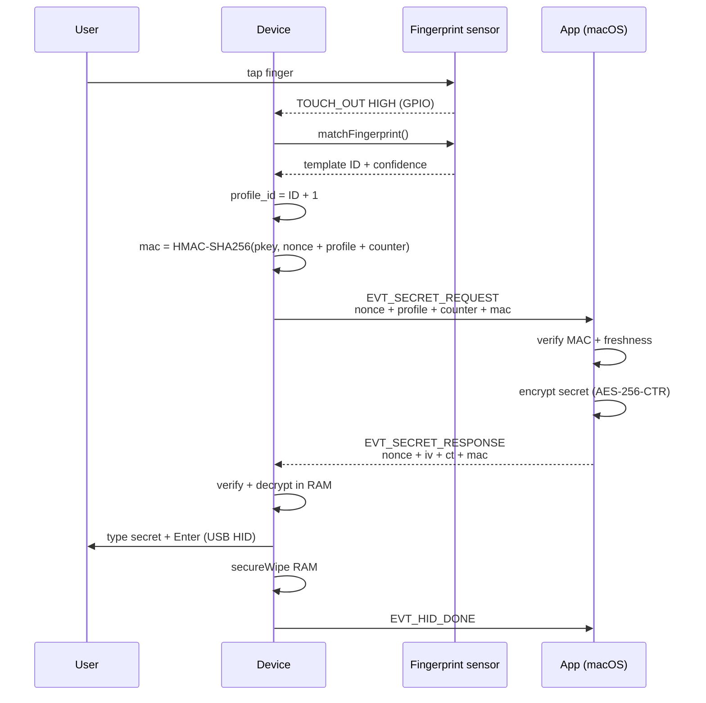

# How FPPBox works

FPPBox (Fingerprint Portable Box) is a small device with a fingerprint sensor. Touch it, and it types your
password for you — without the password ever being stored on the device.

## The big picture

1. You tap your finger.
2. The sensor matches it locally (the fingerprint never leaves the device).
3. The device asks the companion app on your Mac for the password.
4. The app sends it encrypted over USB; the device decrypts, types it, and
   wipes it from memory.

## The flow, step by step

## What each part does

| Part | What it does | What it never does |
|---|---|---|
| Fingerprint sensor | Matches your finger locally | Sends the fingerprint anywhere |
| Device | Requests, decrypts, types | Keeps the password after typing |
| App (macOS) | Verifies the request, sends the encrypted password | Types or shows it |

## Why it's safe

- **Fingerprint stays local.** The sensor only reports "match" / "no match".
- **Password is encrypted in transit.** The request is authenticated with
  HMAC-SHA256 and the secret is encrypted with AES-256-CTR.
- **Device forgets.** After typing, the device wipes the password from RAM.

## FAQ

### I set the device up on Mac A. What happens if I plug it into Mac B?

The device is **not bound to any specific Mac** — it never stores a hostname,
machine ID, or anything that ties it to one computer. "Set up" only means
provisioned (fingerprints enrolled, profiles configured, and — in remote
mode — a pairing key installed). What happens on Mac B depends on the mode:

- **Local mode (credential stored on the device):** it just works on Mac B.
  The fingerprint match makes the device type the stored credential into
  whatever machine it is plugged into. There is no host check. This also
  means anyone with an enrolled fingerprint can trigger that credential on
  any computer — including one that isn't yours.

- **Remote mode (secret stored in the app's keychain):** the device only
  holds the profile reference and the pairing key. On a fingerprint match it
  sends a `SECRET_REQUEST` over USB and waits for the app to reply. On Mac B:
  - If the FPPBox app is not running (or has a different pairing key), nobody
    answers, the request times out, and nothing is typed.
  - If Mac B runs the app provisioned with the **same pairing key**, the flow
    works normally. Trust follows the pairing key, not the machine.

### Can I use the device on two Macs?

- **Local mode:** yes — the credential lives on the device, so any Mac works
  out of the box.
- **Remote mode:** only on Macs whose app has been provisioned with the same
  pairing key. Copying the pairing key to a second Mac makes it work there
  too, but treat the key as a credential: anyone holding it can request the
  secrets.

### What should I watch out for?

- The device types whatever credential is matched — it does not check which
  Mac it is plugged into. Enroll only trusted fingers, and treat a device
  with a stored local credential like the credential itself.

### Is anything sent over the internet? Is there a server?

No. Everything is **fully offline** and runs on your own hardware:

- There is **no server**, no cloud, and no internet connection involved at
  any point in the flow.
- The password is **never sent anywhere**. It goes from the app on your Mac,
  encrypted, over USB to the device — and only when your fingerprint
  matches. The device types it and wipes it from RAM.
- All cryptographic checks (HMAC verification, decryption) happen locally on
  the device and in the app on your Mac.

### Where is my auth info stored?

- **Fingerprint:** stored only on the device, inside the fingerprint sensor
  itself. It never leaves the device — the sensor only reports
  "match"/"no match".
- **Passwords / secrets:** stored only in the app's keychain on your Mac
  (remote mode), never on the device and never on any server. In local mode
  the credential is stored on the device (flash-encrypted) instead.

### Is anything sent anywhere when I touch the sensor?

No. Touching the sensor triggers a local fingerprint match, then — if it
matches — a USB request to the app on the same Mac. Nothing leaves your
machine except keystrokes on the local USB keyboard, and those stay on the
machine you are plugged into.

### How many fingers and passwords can I set up?

Up to **3 fingerprints** (the sensor's capacity). Each enrolled finger
occupies one profile slot. In remote mode, the app stores **one password per
device** (keyed by the device's pairing key) — not one per finger. Every
enrolled finger requests that same password, so enrolling more fingers does
not add more passwords.

### What does the app need on the Mac?

- **App must be running.** In remote mode the device can't type anything
  until the app answers the secret request. If the app isn't running, a
  fingerprint touch just times out.
- **Accessibility permission.** The app uses macOS Accessibility to check
  that the focused field is a secure (password) field before it sends the
  secret. Grant it in System Settings → Privacy & Security → Accessibility.
- **Password in Keychain.** The secret is stored in the macOS Keychain, not
  in a file on disk.

### Can I use it on the login screen?

Not yet. In remote mode the app must be running to answer the request, and
at the login screen no app session exists yet (a LaunchAgent that runs the
app pre-login is planned).

### I lost the device. What happens?

In remote mode, the device holds no secrets — only the pairing key and
fingerprint templates. A stolen device without the app (and its key) cannot
get the password out. Still, treat a lost device as compromised:

- Delete the stored password in the app (revoke the pairing key).
- If you recover the device, use the app's **Reset** option to wipe the old
  fingerprints and pairing key, then set it up again from scratch.

### Why is my finger sometimes not read, or hard to read?

The sensor is small and compares your live finger against the enrolled
template — if the live read is too different, it reports “no match”. Most
causes are on the finger, not the device:

- **Dry, dirty, oily, or wet finger.** Wipe the sensor and your fingertip
  before touching. Dry fingers are the most common cause of weak reads.
- **Bad placement.** Cover the whole sensor window flat with the pad of your
  finger. Touch with the same finger, same angle, and same orientation you
  used during enrollment.
- **Too quick or sliding.** Keep the finger still on the sensor until the
  device types (or the LED gives up) — sliding or lifting too early aborts
  the read.
- **Weak enrollment.** If the enrolled template was captured in a hurry (or
  from the same dry finger), matches will be unreliable. Enroll again,
  slowly, and — if the sensor supports it — enroll the same finger more than
  once.
- **Wrong finger.** The device only accepts fingerprints it has been
  enrolled with. Enrolled fingers are the only ones that can trigger it.

If a finger that used to work stops working, the template did not change —
the live read did (dry skin, cut, angle). Re-enroll the finger and the
problem usually goes away.

### Anything to remember before touching the sensor?

Yes: the device **types into whatever field is focused**. Make sure the
password field is focused (and the app sees it as secure) before touching
— otherwise the password lands in the wrong place.

### Which operating systems are supported?

Currently **macOS only** — Intel, Apple Silicon, and universal (both in one
build). Windows and Linux are not supported yet.

## Disclaimer

FPPBox is provided "as is", without warranty of any kind. No software or
hardware can guarantee absolute security.

- **Not bulletproof.** A determined attacker with physical access, malware on
  your Mac, or advanced tools may still defeat it.
- **No liability.** The authors are not responsible for leaked, lost, or
  compromised passwords, accounts, or data arising from use of this product.
- **Use at your own risk.** Try it with non-critical accounts first, and keep
  recovery options (backup codes, a password manager) available.
- **Shared device caution.** Anyone whose fingerprint is enrolled can trigger
  a password, and anyone with physical access to the device and a running app
  may be able to.
- **Local threats remain.** A keylogger or other malicious software on your
  Mac can still capture what the device types.
